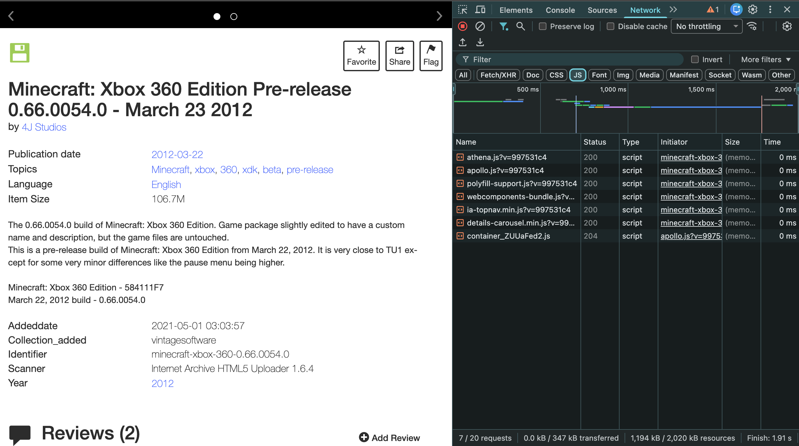

## Inspecting the Cultural Web

I inspected the Internet Archive item page for Minecraft Xbox 360 Edition (v0.66.0054.0).

Item page:
https://archive.org/details/minecraft-xbox-360-0.66.0054.0

Download directory:
https://archive.org/download/minecraft-xbox-360-0.66.0054.0

## Web Technologies Used

Using the browser’s Developer Tools (Network tab), I looked at what files were loaded when the page refreshed.

The page loads as a main document file in the Network tab, which represents the HTML structure of the site. This shows that the website is built using standard HTML.

Under the CSS filter, I observed a file called archive.min.css. This indicates that the site uses CSS for styling and layout.

Under the JavaScript filter, I observed multiple .js files, including athena.js, apollo.js, polyfill-support.js, webcomponents-bundle.js, ia-topnav.min.js, and details-carousel.min.js. These files show that the site uses JavaScript to support interactive features such as navigation, media previews, and dynamic content. 

Based on this inspection, the website uses HTML for structure, CSS for styling, and JavaScript for interactive functionality.

## Who Built the Website?

The website is built and maintained by the Internet Archive, which is a nonprofit digital preservation organization. This is clear from the site branding at the top of the page.

The Internet Archive also has a public GitHub organization:
https://github.com/internetarchive

This GitHub contains repositories related to the Internet Archive’s platform and infrastructure. However, the archived Minecraft files themselves are not stored on GitHub; they are stored directly on the Internet Archive’s servers.

Since the Internet Archive is a large nonprofit organization, it is likely that the website is developed and maintained by a team of developers rather than a single individual.